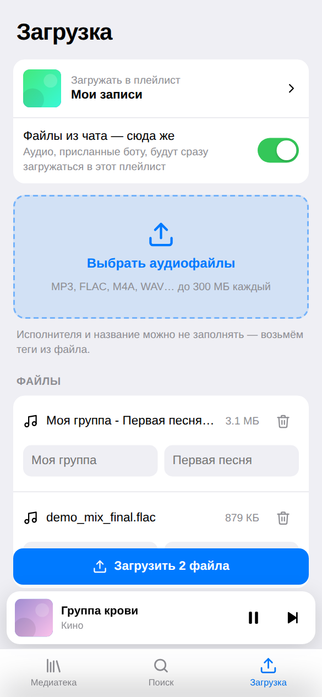

# yamusicbot — Telegram-бот для Яндекс Музыки

> 🧭 **Не программист?** Вот [пошаговый гайд для новичков](docs/GUIDE.md): от аренды сервера до кнопки «Медиатека» в Telegram.

Личный бот, который управляет **вашим** аккаунтом Яндекс Музыки прямо из Telegram. У него два интерфейса:
**мини-приложение** с графическим интерфейсом (кнопка «Медиатека» в чате) и обычные команды в чате.

<p align="center">
  
  
  
  
</p>

- **Мини-приложение «Медиатека».** «Мне нравится» и ваши плейлисты, поиск, встроенный плеер с перемоткой, скачивание трека на телефон, загрузка своих файлов с прогрессом. Подстраивается под светлую и тёмную тему Telegram.
- **Загрузка своих треков.** Пришлите боту аудиофайл (или сразу пачку), выберите плейлист, и файл окажется в вашей Яндекс Музыке, как после кнопки «Загрузить трек» на music.yandex.ru.
  - FLAC, M4A, WAV, OGG и другие форматы бот сам конвертирует в MP3 320 kbps (нужен `ffmpeg`, в Docker-образе он уже есть).
  - Подпись к файлу вида `Исполнитель - Название` записывается в теги трека.
  - `/target` задаёт плейлист, в который файлы будут уходить сразу, без вопроса.
- **Скачивание.** Поиск по названию, ссылки на трек, альбом, плейлист или артиста, «Мне нравится», свои плейлисты. Кнопка «Скачать всё» выгружает список целиком. Треки приходят в MP3 (до 320 kbps) с тегами и обложкой.
- **Управление.** Лайки, добавление трека в плейлист, создание и удаление плейлистов.

> ⚠️ У Яндекс Музыки нет официального API. Бот использует неофициальный API (библиотека
> [yandex-music](https://github.com/MarshalX/yandex-music-api)) и веб-эндпоинт загрузки
> `api.music.yandex.ru/loader/upload-url`, тот же, что использует сайт music.yandex.ru. Яндекс может изменить их без предупреждения
> (так уже было в 2026 году; если загрузка сломается, `python -m bot.diag_upload` поможет найти новый адрес).
> Для полноценного скачивания нужна подписка Яндекс Плюс.

## Быстрый старт

### 1. Создайте бота
Напишите [@BotFather](https://t.me/BotFather) команду `/newbot` и сохраните выданный токен. Это `BOT_TOKEN`.

### 2. Установите зависимости и настройте
```bash
python -m venv .venv && source .venv/bin/activate   # Python 3.11+
pip install -r requirements.txt
cp .env.example .env    # впишите BOT_TOKEN
```

### 3. Получите токен Яндекс Музыки
Бот работает от вашего аккаунта по OAuth-токену (`YANDEX_MUSIC_TOKEN`). Получить его можно одной командой:

```bash
python -m bot.get_token
```

Команда покажет ссылку и код. Откройте ссылку, введите код и подтвердите вход своим аккаунтом Яндекса. Токен сам запишется в `.env`.

Если так не получается, возьмите токен из браузера:

1. Откройте DevTools (F12) → вкладка **Network (Сеть)**, включите **Preserve log (Сохранять журнал)**.
2. Перейдите по ссылке
   `https://oauth.yandex.ru/authorize?response_type=token&client_id=23cabbbdc6cd418abb4b39c32c41195d`
   и войдите в свой аккаунт Яндекса.
3. Вас перебросит на music.yandex.ru. В журнале сети найдите запрос, в адресе которого есть `#access_token=...`.
   Всё, что стоит между `access_token=` и `&`, и есть токен (обычно начинается с `y0_`). Впишите его в `.env`.

Подробнее в [документации yandex-music](https://yandex-music.readthedocs.io/en/main/token.html).

**Токен даёт полный доступ к аккаунту.** Никому его не показывайте и не коммитьте файл `.env`.

### 4. Разрешите доступ себе
Свой Telegram ID можно не искать: запустите бота с пустым `ALLOWED_USERS` и напишите ему. Он ответит вашим ID. Впишите его в `ALLOWED_USERS` и перезапустите бота. Пользоваться ботом могут только люди из этого списка.

### 5. Запустите

```bash
# чтобы конвертировать не-MP3 файлы: sudo apt install ffmpeg  (или brew install ffmpeg)
python -m bot
```

**Или через Docker (ffmpeg уже внутри образа):**
```bash
docker compose run --rm bot python -m bot.get_token   # напечатает токен, вставьте его в .env
docker compose up -d --build
docker compose logs -f
```

Бот в чате заработает сразу. Чтобы появилась кнопка «Медиатека», настройте мини-приложение (следующий раздел).

## Мини-приложение

Мини-приложение отдаёт тот же процесс, что и бот: встроенный веб-сервер на порту `8080` (`WEB_PORT`).
Telegram открывает мини-приложения **только по HTTPS**, поэтому серверу нужен публичный HTTPS-адрес.
Укажите его в `WEBAPP_URL` и перезапустите бота: он сам поставит кнопку «Медиатека» слева от поля ввода, а команда `/app` пришлёт кнопку в чат.

**Вариант А: свой домен (для постоянной работы).** Подойдёт и бесплатный поддомен [DuckDNS](https://www.duckdns.org).
Направьте A-запись домена на сервер, откройте порты 80 и 443 и впишите в `.env`:
```bash
DOMAIN=music.example.com
WEBAPP_URL=https://music.example.com
COMPOSE_PROFILES=https
```
Затем перезапустите. Вместе с ботом поднимется встроенный Caddy и сам получит сертификат Let's Encrypt:
```bash
docker compose up -d --build --force-recreate
```

**Вариант Б: сервер без открытых портов (за NAT) — туннель [fxTunnel](https://github.com/mephistofox/fxtun.dev).**
Российский сервис: бесплатно, свой поддомен `https://имя.fxtun.ru`, HTTPS, открывается из России
(туннели Cloudflare там сейчас замедляют). Зарегистрируйтесь на https://fxtun.ru, создайте токен в разделе «Токены»
и впишите в `.env`:
```bash
FXTUNNEL_TOKEN=sk_fxtunnel_...   # показывается один раз при создании
FXTUNNEL_DOMAIN=my-music        # 3–32 символа: латиница, цифры, дефис
COMPOSE_PROFILES=tunnel
```
`WEBAPP_URL` бот возьмёт сам: `https://my-music.fxtun.ru`. Запуск: `docker compose up -d --build --force-recreate`,
проверка: `docker compose logs --tail 20 tunnel` (строка `HTTP: https://…`).
При первом открытии fxTunnel покажет страницу-предупреждение — нажмите «Продолжить» один раз, дальше приложение
само продлевает согласие.

**Что умеет:**
- **Медиатека**: «Мне нравится» и ваши плейлисты. Плейлист можно создать, переименовать, удалить, убрать из него трек и назначить целевым для загрузки файлов из чата.
- **Поиск** по трекам, альбомам, артистам и плейлистам. Из результатов открываются альбом и популярное артиста.
- **Плеер**: мини-плеер над вкладками, полноэкранный режим с перемоткой, очередь из текущего списка, управление с экрана блокировки.
- **Меню трека** «⋯»: скачать на телефон, отправить в чат, добавить в плейлист, открыть альбом или исполнителя. «Всё в чат» отправляет боту весь список.
- **Загрузка**: выбираете файлы, плейлист и при желании исполнителя с названием, дальше видно прогресс по каждому файлу. Файлы идут с телефона прямо на ваш сервер, поэтому лимит Telegram в 20 МБ здесь не действует. Предел задаёт `WEB_MAX_UPLOAD_MB` (по умолчанию 300 МБ).

**Безопасность.** Каждый запрос к API подписан Telegram (`initData`). Сервер проверяет подпись токеном бота и пускает только пользователей из `ALLOWED_USERS`.
Ссылки на прослушивание и скачивание подписаны отдельно и действуют 6 часов.

## Команды

| Команда | Что делает |
|---|---|
| кнопка «Медиатека», `/app` | открыть мини-приложение |
| любой текст | поиск (вкладки: треки / альбомы / плейлисты / артисты) |
| ссылка music.yandex.ru | трек придёт сразу; альбом, плейлист или артист откроются списком |
| аудиофайл | загрузка в Яндекс Музыку |
| `/likes` | «Мне нравится» |
| `/playlists` | ваши плейлисты (открыть, скачать, удалить, сделать целевым для загрузки) |
| `/target` | плейлист, куда сразу загружаются присланные файлы |
| `/newplaylist название` | создать плейлист |
| `/cancel` | отменить текущее действие |

## Ограничения

- **Размер файлов в чате.** Облачный Bot API Telegram разрешает ботам скачивать файлы до **20 МБ** и отправлять до **50 МБ**. Для обычного MP3 этого хватает, а большие файлы проще загружать через мини-приложение. Ещё лимиты снимает [свой Bot API сервер](https://github.com/tdlib/telegram-bot-api): запустите его с флагом `--local` и укажите `BOT_API_URL=http://адрес:8081` и `BOT_API_LOCAL=true`. Бот и сервер должны видеть одну и ту же файловую систему.
- **Обработка загрузки.** После загрузки Яндекс ещё пару минут обрабатывает файл, только потом трек появляется в плейлисте. Название и исполнитель берутся из тегов файла.
- **Скачивание на телефон из мини-приложения** использует `downloadFile` из Telegram 8.0+. В старых версиях Telegram файл откроется в браузере, также можно нажать «Отправить в чат».
- **Регион.** Часть каталога Яндекс Музыки недоступна за пределами РФ и СНГ. Если бот работает на зарубежном сервере, некоторые треки могут не скачиваться.

## Разработка

```bash
pip install -r requirements-dev.txt
pytest          # тесты: ссылки, теги, протокол загрузки, сценарии бота, API мини-приложения
ruff check .    # линтер
```

Структура:

```
bot/
  main.py           запуск, сборка Bot и Dispatcher
  config.py         настройки из .env
  get_token.py      получение токена Яндекс Музыки (python -m bot.get_token)
  ym.py             Яндекс Музыка: каталог, лайки, плейлисты, скачивание, загрузка (UGC)
  audio.py          ID3-теги, конвертация через ffmpeg
  sender.py         отправка треков в Telegram (+ кэш file_id)
  sources.py        списки треков и постраничный вывод
  links.py          разбор ссылок music.yandex.*
  handlers/         обработчики: common, browse (поиск/плейлисты), download, upload
  web/
    app.py          HTTP API мини-приложения, плеер (прокси с Range), скачивание, загрузка
    auth.py         проверка initData Telegram, подписанные ссылки на аудио
    static/         интерфейс: index.html, style.css, app.js (без сборки и зависимостей)
```
