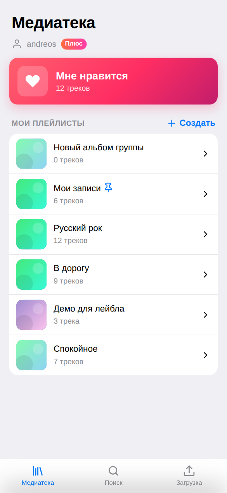
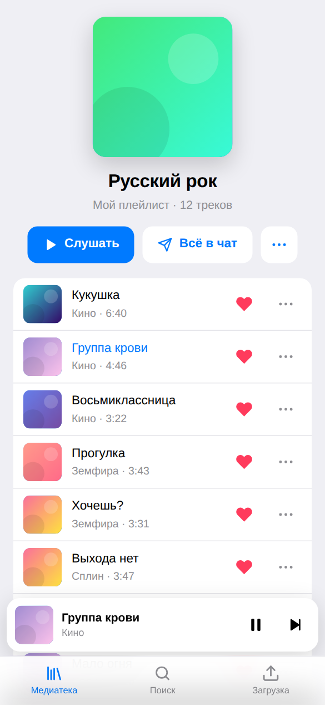
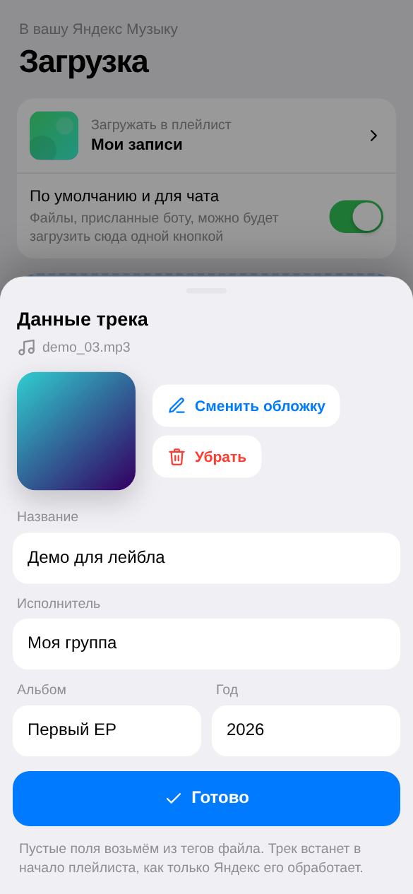
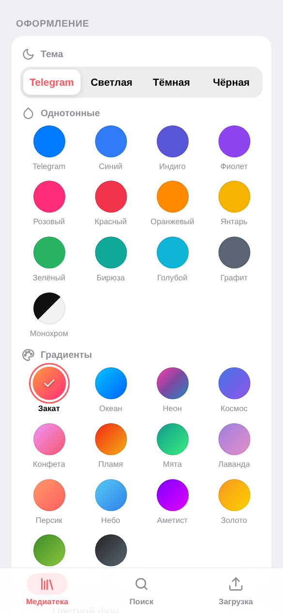
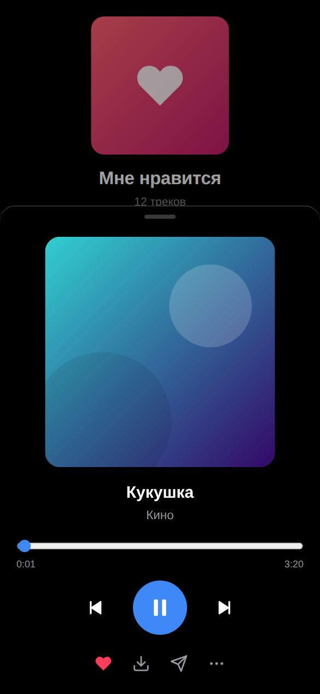
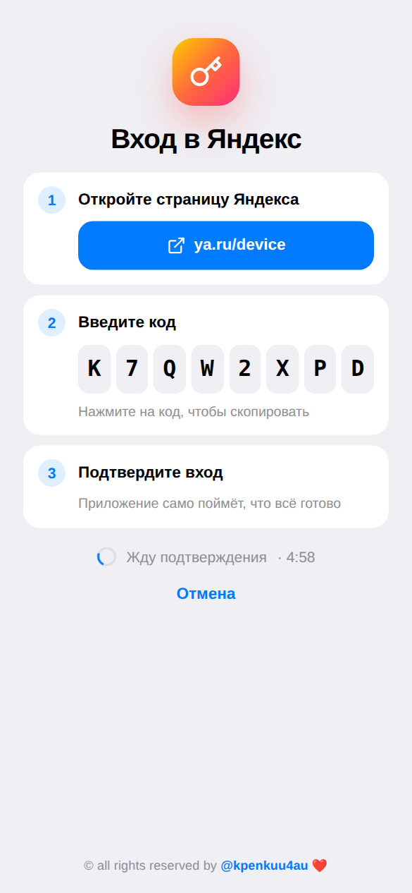
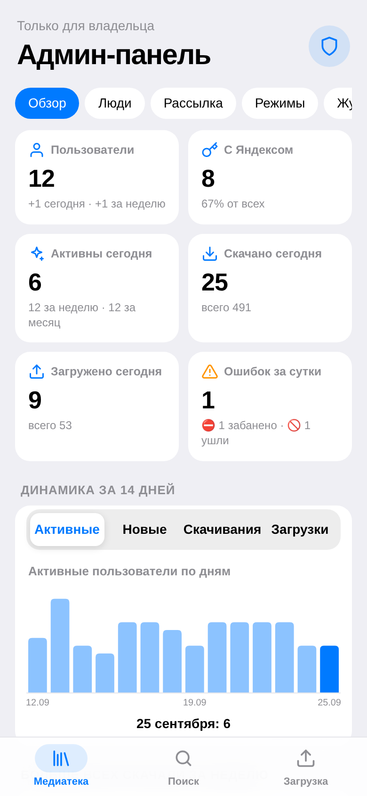
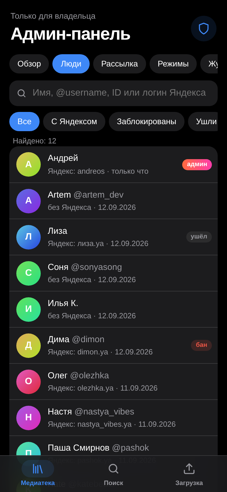

# yamusicbot — Telegram-бот для Яндекс Музыки

> 🧭 **Не программист?** Вот [пошаговый гайд для новичков](docs/GUIDE.md): от аренды сервера до кнопки «Медиатека» в Telegram.

Бот для Яндекс Музыки, которым можно поделиться с друзьями: каждый сам подключает **свой** аккаунт Яндекса
и пользуется ботом независимо от остальных. У бота два интерфейса: **мини-приложение** с графическим
интерфейсом (кнопка «Медиатека» в чате) и обычные команды в чате.

<p align="center">
  
  
  
  
  
  
  
  
</p>

- **Свой аккаунт у каждого.** Человек открывает бота, нажимает «Подключить Яндекс Музыку», вводит код на странице Яндекса, и всё: плейлисты, лайки и загрузки у него свои. Пароль бот не видит, отключить аккаунт можно командой `/logout` или в приложении.
- **Мини-приложение «Медиатека».** «Мне нравится» и плейлисты сеткой обложек, поиск с историей, плеер с перемешиванием, повтором и перемоткой, скачивание трека на телефон, загрузка своих файлов с прогрессом. Подстраивается под светлую и тёмную тему Telegram.
- **Загрузка своих треков.** Пришлите боту аудиофайл (или сразу пачку), выберите плейлист, и файл окажется в вашей Яндекс Музыке, как после кнопки «Загрузить трек» на music.yandex.ru.
  - **Мини-редактор** перед загрузкой: название, исполнитель, альбом, год и обложка (в чате — пришлите картинку, в приложении — выберите из галереи). Что не трогали, берётся из тегов файла.
  - **Загруженный трек встаёт в начало плейлиста**, а не в конец: бот дожидается, пока Яндекс обработает файл (обычно минута-две), и переставляет его наверх. Пачка файлов встаёт наверх в порядке загрузки.
  - FLAC, M4A, WAV, OGG и другие форматы бот сам конвертирует в MP3 320 kbps (нужен `ffmpeg`, в Docker-образе он уже есть), обложка из файла сохраняется.
  - Подпись к файлу вида `Исполнитель - Название` сразу записывается в теги трека; старые русские теги в cp1251 читаются правильно.
  - `/target` задаёт плейлист по умолчанию: файлы из чата загружаются в него одной кнопкой.
- **Скачивание.** Поиск по названию, ссылки на трек, альбом, плейлист или артиста, «Мне нравится», свои плейлисты. Кнопка «Скачать всё» выгружает список целиком. Треки приходят в MP3 (до 320 kbps) с тегами и обложкой.
- **Управление.** Лайки, добавление трека в плейлист, создание и удаление плейлистов.
- **Инлайн-режим.** В любом чате наберите `@имя_бота кукушка` — бот найдёт трек в вашей Яндекс Музыке, и он уйдёт собеседнику аудиофайлом. Пустой запрос показывает «Мне нравится», ссылка music.yandex.* — трек, альбом или плейлист.
- **Админ-панель для владельца.** Статистика, пользователи с поиском, блокировки, рассылка, техработы, закрытая регистрация, дневные лимиты, журнал действий, ошибки по коду и бэкап базы — в «Медиатеке» и командой `/admin`. Владелец (`ADMIN_IDS`) может прямо в приложении назначать других админов и снимать с них права.

> ⚠️ У Яндекс Музыки нет официального API. Бот использует неофициальный API (библиотека
> [yandex-music](https://github.com/MarshalX/yandex-music-api)) и веб-эндпоинт загрузки
> `api.music.yandex.ru/loader/upload-url`, тот же, что использует сайт music.yandex.ru. Яндекс может изменить их без предупреждения
> (так уже было в 2026 году). Бот следит за этим сам: если загрузка перестаёт работать у нескольких людей подряд,
> владелец получает сообщение с инструкцией, а в админ-панели появляется предупреждение; `python -m bot.diag_upload`
> поможет найти новый адрес.
> Для полноценного скачивания нужна подписка Яндекс Плюс — у каждого пользователя своя.

## Быстрый старт

### 1. Создайте бота
Напишите [@BotFather](https://t.me/BotFather) команду `/newbot` и сохраните выданный токен. Это `BOT_TOKEN`.

### 2. Настройте и запустите
```bash
cp .env.example .env    # впишите BOT_TOKEN — больше ничего не обязательно
docker compose up -d --build
docker compose logs -f
```

Без Docker:
```bash
python -m venv .venv && source .venv/bin/activate   # Python 3.11+
pip install -r requirements.txt
# чтобы конвертировать не-MP3 файлы: sudo apt install ffmpeg  (или brew install ffmpeg)
python -m bot
```

### 3. Подключите Яндекс Музыку
Напишите боту `/start` и нажмите «Подключить Яндекс Музыку». Бот покажет код: откройте ya.ru/device,
введите код и подтвердите вход своим аккаунтом. Бот сам заметит, что всё готово. Так же подключаются все,
кому вы дадите ссылку на бота.

Бот в чате заработает сразу. Чтобы появилась кнопка «Медиатека», настройте мини-приложение (следующий раздел).

> **Обновляетесь со старой версии** (с `YANDEX_MUSIC_TOKEN` и `ALLOWED_USERS` в `.env`)? Ничего делать не нужно:
> при первом запуске бот сам привяжет старый токен к пользователям из `ALLOWED_USERS`, настройки перенесутся
> из `data/storage.json` в `data/bot.db`. После этого обе переменные можно удалить из `.env`.

## Кому доступен бот

Любому, у кого есть ссылка на него: белого списка нет. Каждый пользователь работает только со своим аккаунтом
Яндекса — чужие плейлисты, лайки и загрузки ему не видны.

Учтите, что бот работает на **вашем** сервере: входы пользователей (OAuth-токены Яндекс Музыки) хранятся
в `data/bot.db` зашифрованными (права 600 — читать может только владелец сервера), а скачивание и загрузка идут через ваш
интернет-канал. Давайте ссылку тем, кто вам доверяет. Отключённый пользователем аккаунт (`/logout`) удаляется
из базы; полностью отозвать доступ можно в Яндекс ID.

## Инлайн-режим

Его нужно один раз включить в @BotFather (Telegram не даёт сделать это из кода):

1. `/setinline` → выберите бота → введите подсказку, например `Поиск музыки…`
2. `/setinlinefeedback` → выберите бота → `Enabled` (100%). Без этого трек, который ещё ни разу не отправлялся,
   застрянет на «⏳ Загружаю…»: бот не узнает, что его выбрали.

Как это работает: трек, который бот уже отправлял, уходит сразу. Новый сначала появляется как «⏳ Загружаю…»,
бот скачивает его, на секунду кладёт к себе в чат (без звука) и тут же подменяет сообщение аудиофайлом. Под треком —
кнопка «Слушать в боте», по ней собеседник сам откроет бота. Треки берутся из аккаунта Яндекса того, кто пишет запрос,
и считаются в его дневной лимит скачиваний.

## Админ-панель

Впишите в `.env` свой Telegram ID (его покажет @userinfobot) и перезапустите бота:

```env
ADMIN_IDS=123456789
```

После этого у вас (владельца) появятся:

- **в «Медиатеке»** — щит 🛡 рядом с шестерёнкой (и пункт «Админ-панель» в настройках):
  - **Обзор:** пользователи, подключённые к Яндексу, активные за день, неделю и месяц, скачивания и загрузки,
    график за 14 дней, топ за неделю, состояние сервера (память, диск, размер базы, ffmpeg) и кнопка бэкапа;
  - **Люди:** поиск по имени, @username, ID или логину Яндекса, фильтры; в карточке — блокировка с причиной,
    отключение Яндекса, сообщение от имени бота, сброс дневного лимита;
  - **Рассылка:** текст с HTML-разметкой, «отправить себе» для проверки, всем или только с подключённым Яндексом,
    прогресс и остановка; кто заблокировал бота, помечается и больше не получает рассылки;
  - **Режимы:** техработы со своим текстом (бот отвечает только админам), закрытая регистрация (новые не допускаются,
    старые пользуются как раньше), лимиты скачиваний и загрузок на человека в сутки;
  - **Журнал:** все действия админов и попытки чужих открыть админку; последние ошибки с поиском по коду из
    сообщения «Что-то пошло не так (код …)».
- **в чате** — `/admin` (сводка и кнопки: техработы, регистрация, рассылка, админы, бэкап, ошибки, журнал),
  `/user ID`, `/ban ID причина`, `/unban ID`, `/broadcast`, `/admins`. Остальным эти команды не видны и не работают.

### Назначенные админы

Владелец может раздать доступ к панели другим людям — без правки `.env` и перезапуска:

- **в «Медиатеке»:** админ-панель → «Люди» → нажмите на человека → «Сделать админом» (снять — там же, кнопка
  «Снять права админа»). Список всех админов — внизу вкладки «Режимы», фильтр «Админы» — на вкладке «Люди»;
- **в чате:** `/user ID` → «🛡 Сделать админом» / «🚫 Снять права админа», список — `/admins`.

Человеку придёт сообщение о новых правах, в меню бота у него появятся админ-команды. Права действуют и снимаются
сразу: открытая админ-панель у снятого админа перестаёт работать на следующем же запросе.

| Что можно | Владелец (`ADMIN_IDS`) | Назначенный админ |
|---|---|---|
| статистика, люди, блокировки, рассылка, режимы, лимиты, журнал, ошибки | ✅ | ✅ |
| назначать и снимать админов | ✅ | ❌ |
| бэкап базы (в нём входы всех пользователей) | ✅ | ❌ |
| отключать Яндекс у других админов | ✅ | ❌ |
| быть снятым из приложения | ❌ (только в `.env`) | ✅ |

Назначить можно только того, кто уже писал боту и не заблокирован; админа нельзя заблокировать.

Как защищена:

- Владельцев задаёт только `ADMIN_IDS` в `.env`. Назначать админов в приложении может только владелец, а
  назначенный админ не может ни назначить другого, ни снять владельца.
- В чате ID отправителя подставляет Telegram. В приложении каждый запрос подписан Telegram (initData), и для админки
  подпись должна быть свежей — не старше часа.
- Для всех остальных админ-API не существует (ответ 404). Попытка попадает в журнал, а владельцу приходит сообщение 🚨.
- Бэкап базы (в нём входы пользователей) делает только владелец, и файл приходит ему в личный чат с ботом —
  скачать его по ссылке нельзя.
- Админа нельзя заблокировать, на админов не действуют техработы и лимиты.

Совет: включите облачный пароль (двухэтапную проверку) в Telegram — админка защищена вашим аккаунтом Telegram.

## Безопасность

Как бот защищает пользователей и сервер:

- **Мини-приложение.** Каждый запрос подписан Telegram (initData, HMAC с токеном бота): без подписи API не отвечает,
  а данные берутся только из аккаунта Яндекса того, кто открыл приложение. Страница отдаётся с Content-Security-Policy:
  скрипты — только свои и Telegram.
- **Токен Яндекса** показывается только его владельцу и только в недавно открытом приложении (подпись моложе часа);
  в чат бот его не пишет. Токен уходит только на серверы Яндекса по HTTPS.
- **Чужие файлы.** Формат аудио и картинок бот определяет по содержимому и называет ffmpeg явно; ffmpeg открывает
  только сам файл (без плейлистов, ссылок и сети), время работы и размер результата ограничены, огромные картинки
  отклоняются. Из приложения файлы принимаются по одному на человека и не больше трёх одновременно
  (размер — `WEB_MAX_UPLOAD_MB`), в чате очередь — до 30 файлов.
- **Ошибки** пользователю показываются без технических подробностей, с коротким кодом — по нему запись находится
  в логах: `docker compose logs | grep код`.
- **Контейнер** работает без лишних прав Linux (`cap_drop`, `no-new-privileges`), веб-порт слушает только 127.0.0.1.
- **Входы в базе зашифрованы** (Fernet: AES + HMAC). Ключ — `ENCRYPTION_KEY` из `.env`, а если его нет, файл
  `data/secret.key`, который бот создаёт сам (права 600). Бэкап из админ-панели и сам `bot.db` без ключа токенов
  не раскрывают. Входы, сохранённые прежними версиями, шифруются при первом запуске.

Что стоит знать владельцу:

- Шифрование защищает базу и бэкапы, но не сервер целиком: кто получил и `data`, и `.env`, получит и токены —
  боту они нужны в расшифрованном виде. Берегите сервер: вход по SSH-ключу, обновления системы, `chmod 600 .env`.
- Хотите, чтобы и вся папка `data` без `.env` была бесполезна? Перенесите ключ в `.env`:
  `docker compose exec bot cat /data/secret.key`, впишите вывод в `.env` строкой `ENCRYPTION_KEY=...`,
  перезапустите бота (`docker compose up -d --force-recreate`) и удалите `data/secret.key`. Любой новый ключ тоже
  подойдёт: при запуске бот сам перешифрует входы, пока старый `data/secret.key` ещё на месте.
- Храните ключ отдельно от бэкапов: без него восстановленная база не расшифруется, и пользователям придётся
  подключить Яндекс заново (бот при этом не сломается).
- `/logout` удаляет вход из базы бота, но не отзывает его у Яндекса: для этого — «Выйти на всех устройствах» в Яндекс ID.
- Ссылки на прослушивание и скачивание в приложении подписаны и действуют 6 часов — не пересылайте их.
- Вход по коду (ya.ru/device): вводите код, только если сами получили его в этом боте. Тот, кто уговорит вас ввести
  присланный им код, получит доступ к вашей Яндекс Музыке.
- Обновляйтесь: `git pull && docker compose build --pull && docker compose up -d` — так приезжают исправления бота,
  Python, ffmpeg и библиотек.

## Мини-приложение

Мини-приложение отдаёт тот же процесс, что и бот: встроенный веб-сервер на порту `8080` (`WEB_PORT`).
Telegram открывает мини-приложения **только по HTTPS**, поэтому серверу нужен публичный HTTPS-адрес.
Укажите его в `WEBAPP_URL` и перезапустите бота: он сам поставит кнопку «Медиатека» слева от поля ввода, а команда `/app` пришлёт кнопку в чат.

**Вариант А: свой домен (для постоянной работы).** Подойдёт и бесплатный поддомен [DuckDNS](https://www.duckdns.org).
Направьте A-запись домена на сервер, откройте порты 80 и 443 и впишите в `.env`:
```bash
DOMAIN=music.example.com
WEBAPP_URL=https://music.example.com
COMPOSE_PROFILES=https
```
Затем перезапустите. Вместе с ботом поднимется встроенный Caddy и сам получит сертификат Let's Encrypt:
```bash
docker compose up -d --build --force-recreate
```

**Вариант Б: сервер без открытых портов (за NAT) — туннель [fxTunnel](https://github.com/mephistofox/fxtun.dev).**
Российский сервис: бесплатно, свой поддомен `https://имя.fxtun.ru`, HTTPS, открывается из России
(туннели Cloudflare там сейчас замедляют). Зарегистрируйтесь на https://fxtun.ru, создайте токен в разделе «Токены»
и впишите в `.env`:
```bash
FXTUNNEL_TOKEN=sk_fxtunnel_...   # показывается один раз при создании
FXTUNNEL_DOMAIN=my-music        # 3–32 символа: латиница, цифры, дефис
COMPOSE_PROFILES=tunnel
```
`WEBAPP_URL` бот возьмёт сам: `https://my-music.fxtun.ru`. Запуск: `docker compose up -d --build --force-recreate`,
проверка: `docker compose logs --tail 20 tunnel` (строка `HTTP: https://…`).
При первом открытии fxTunnel покажет страницу-предупреждение — нажмите «Продолжить» один раз, дальше приложение
само продлевает согласие.

**Что умеет:**
- **Вход**: кто ещё не подключил Яндекс, видит экран входа с кодом и кнопкой «Открыть ya.ru/device»; приложение само замечает подтверждение. Аватар в углу медиатеки открывает аккаунт: сменить или отключить.
- **Медиатека**: «Мне нравится» (кнопка ▶ сразу включает перемешанные лайки) и плейлисты сеткой обложек. Плейлист можно создать, переименовать, удалить, убрать из него трек и назначить целевым для загрузки файлов из чата.
- **Поиск** по трекам, альбомам, артистам и плейлистам с историей запросов. Из результатов открываются альбом и популярное артиста.
- **Плеер**: мини-плеер над вкладками, полноэкранный режим на размытой обложке с перемоткой, перемешиванием и повтором, управление с экрана блокировки.
- **Меню трека** «⋯»: скачать на телефон, отправить в чат, добавить в плейлист, открыть альбом или исполнителя. «⋯» у списка отправляет боту весь список.
- **Загрузка**: выбираете файлы и плейлист; нажатие на файл открывает редактор с обложкой, названием, исполнителем, альбомом и годом (теги и обложка MP3/FLAC читаются прямо на телефоне, новая обложка сжимается там же). Дальше видно прогресс по каждому файлу, а загруженные треки встают в начало плейлиста. Файлы идут с телефона прямо на ваш сервер, поэтому лимит Telegram в 20 МБ здесь не действует. Предел задаёт `WEB_MAX_UPLOAD_MB` (по умолчанию 300 МБ).
- **Настройки** (⚙️ в правом верхнем углу «Медиатеки» или «Настройки» в меню Telegram):
  - аккаунт Яндекса — сменить или отключить;
  - **токен Яндекс Музыки** — скрыт, пока не нажмёте «Показать»; есть «Скопировать»;
  - **оформление**: тема (как в Telegram, светлая, тёмная, чёрная AMOLED), 13 однотонных палитр (включая графит и монохром) и 14 градиентов, «цветной фон»; сохраняется в облаке Telegram и одинаково на всех устройствах;
  - **качество** отдельно для скачивания/отправки в чат и для плеера: 320, 192, 128 или 64 kbps (не выше `MAX_BITRATE`);
  - вибрация, анимации, очистка истории поиска.
- **Быстрота**: у каждой вкладки свой стек экранов — «назад» возвращает на то же место без перезагрузки; статика отдаётся сжатой и кэшируется до обновления бота; списки подгружаются по мере прокрутки.

**Безопасность.** Каждый запрос к API подписан Telegram (`initData`): сервер проверяет подпись токеном бота
и работает только с аккаунтом Яндекса того, кто открыл приложение. Ссылки на прослушивание и скачивание подписаны
отдельно, привязаны к пользователю и действуют 6 часов. Токен Яндекса приложение показывает только его владельцу
и только по нажатию «Показать»; в чат бот его не присылает, чтобы он не остался в истории переписки.

## Команды

| Команда | Что делает |
|---|---|
| `/start`, `/menu` | главное меню (или подключение Яндекса для нового пользователя) |
| кнопка «Медиатека», `/app` | открыть мини-приложение |
| любой текст | поиск (вкладки: треки / альбомы / плейлисты / артисты) |
| ссылка music.yandex.ru | трек придёт сразу; альбом, плейлист или артист откроются списком |
| аудиофайл | карточка загрузки: ✏️ редактор данных трека и выбор плейлиста |
| `/likes` | «Мне нравится» |
| `/playlists` | ваши плейлисты (открыть, скачать, удалить, сделать целевым для загрузки) |
| `/target` | плейлист по умолчанию для загрузки (одна кнопка вместо выбора) |
| `/newplaylist название` | создать плейлист |
| `/settings` | качество скачивания и аккаунт (оформление и токен — ⚙️ в приложении) |
| `/login`, `/logout` | подключить (сменить) или отключить свой аккаунт Яндекса |
| `/cancel` | отменить текущее действие |
| `@имя_бота запрос` | в любом чате: найти трек и отправить собеседнику (инлайн-режим) |
| `/admin`, `/user`, `/ban`, `/unban`, `/broadcast` | только для `ADMIN_IDS`: админ-панель в чате |

## Ограничения

- **Размер файлов в чате.** Облачный Bot API Telegram разрешает ботам скачивать файлы до **20 МБ** и отправлять до **50 МБ**. Для обычного MP3 этого хватает, а большие файлы проще загружать через мини-приложение. Ещё лимиты снимает [свой Bot API сервер](https://github.com/tdlib/telegram-bot-api): запустите его с флагом `--local` и укажите `BOT_API_URL=http://адрес:8081` и `BOT_API_LOCAL=true`. Бот и сервер должны видеть одну и ту же файловую систему.
- **Обработка загрузки.** После загрузки Яндекс ещё пару минут обрабатывает файл, только потом трек появляется в плейлисте — и тогда бот переставляет его в начало. Если Яндекс не покажет трек за 15 минут или не даст его переставить, трек останется в конце плейлиста (бот напишет об этом в чате). Название, исполнитель и обложка берутся из тегов файла или из правок в редакторе.
- **Скачивание на телефон из мини-приложения** использует `downloadFile` из Telegram 8.0+. В старых версиях Telegram файл откроется в браузере, также можно нажать «Отправить в чат».
- **Регион.** Часть каталога Яндекс Музыки недоступна за пределами РФ и СНГ. Если бот работает на зарубежном сервере, некоторые треки могут не скачиваться.

## Разработка

```bash
pip install -r requirements-dev.txt
pytest          # тесты: аккаунты и вход, ссылки, теги, протокол загрузки, сценарии бота, API мини-приложения
ruff check .    # линтер
```

Несколько решений, которые стоит знать, прежде чем менять код:

- **SQLite, одно соединение.** Бот — один процесс asyncio: запросы и так идут по очереди, пул соединений ничего
  не даст. Дорогой была запись с fsync на каждый запрос (~1,5 мс, весь бот в это время стоит) — поэтому база
  в режиме WAL с `synchronous=NORMAL` (~0,06 мс на запись). Если понадобится несколько процессов бота, это повод
  переходить на PostgreSQL, а не на пул к SQLite.
- **Правила данных трека в двух местах.** Мини-приложение показывает теги файла ещё до загрузки, поэтому разбор
  имени файла, cp1251 в старых ID3 и объединение правок с тегами есть и на сервере (`bot/audio.py`), и в
  `bot/web/static/meta.js`. Обе реализации проверяются на одних примерах — `tests/fixtures/meta_cases.json`
  (для JS-части нужен `node`). Меняете правило — добавьте пример туда.
- **Ошибки.** Фоновые задачи запускаются через `errors.spawn`, а сбои пишутся через `errors.log_failure`: сеть,
  Telegram, Яндекс и понятные пользователю ошибки — строкой WARNING, всё остальное (скорее всего баг) — ERROR
  с трассировкой; такие записи видны в админ-панели.
- **Загрузка через неофициальный API.** Ответы адреса загрузки, по которым видно, что Яндекс его изменил
  (`UploadEndpointError`), отличаются от проблем конкретного пользователя (отозванный вход, нет сети, формат файла).
  После 3 таких сбоев подряд или у 2 разных людей владелец получает сообщение, после первой успешной загрузки — что всё
  снова работает.

Структура:

```
bot/
  main.py           запуск, сборка Bot и Dispatcher
  config.py         настройки из .env
  accounts.py       аккаунты пользователей: вход по коду Яндекса, клиенты, выход
  storage.py        база SQLite (data/bot.db, режим WAL): входы, настройки, кэш file_id, данные админки
  crypto.py         шифрование входов пользователей в базе
  errors.py         тексты ошибок для чата, запись ошибок в лог, фоновые задачи
  middlewares.py    подстановка аккаунта Яндекса пользователя в обработчики
  ym.py             Яндекс Музыка: каталог, лайки, плейлисты, скачивание, загрузка (UGC)
  audio.py          теги и обложки (MP3/FLAC/OGG/M4A), редактор данных, конвертация через ffmpeg
  sender.py         отправка треков в Telegram (+ кэш file_id на аккаунт)
  admin.py          админка: владельцы и назначенные админы, блокировки, техработы, лимиты, статистика,
                    рассылка, журнал, бэкап
  commands.py       меню команд бота (общее и для админов)
  placer.py         загруженные треки — в начало плейлиста, когда Яндекс их обработает
  settings.py       настройки пользователя на сервере: качество скачивания и прослушивания
  sources.py        списки треков и постраничный вывод
  links.py          разбор ссылок music.yandex.*
  handlers/         обработчики: common (меню), account (вход), browse, download, upload (очередь и редактор),
                    inline (инлайн-режим), admin (админка в чате)
  web/
    app.py          HTTP API мини-приложения, вход, плеер (прокси с Range), скачивание, загрузка
    admin_api.py    API админ-панели (/api/admin/*)
    auth.py         проверка initData Telegram, подписанные ссылки на аудио
    static/         интерфейс: index.html, style.css, app.js, meta.js (без сборки и зависимостей)
```
